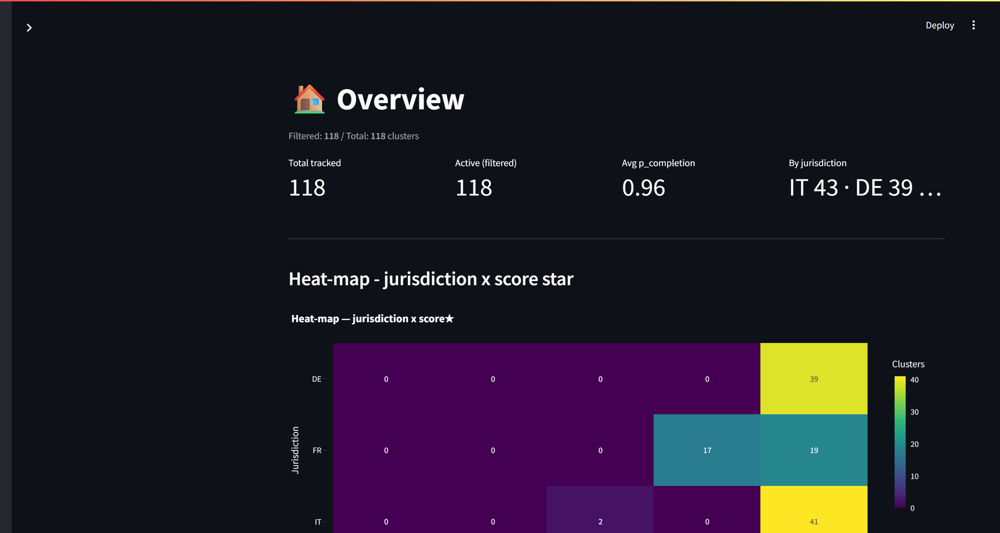
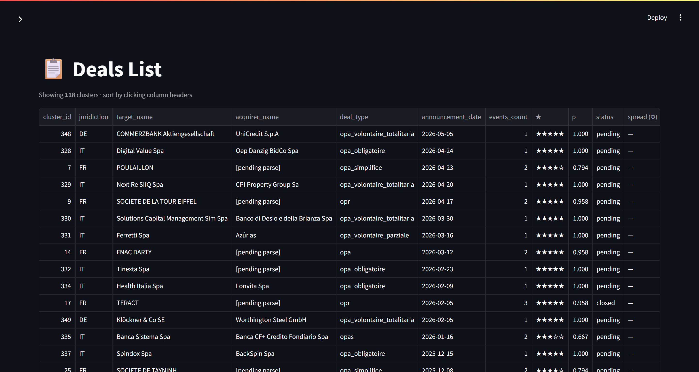
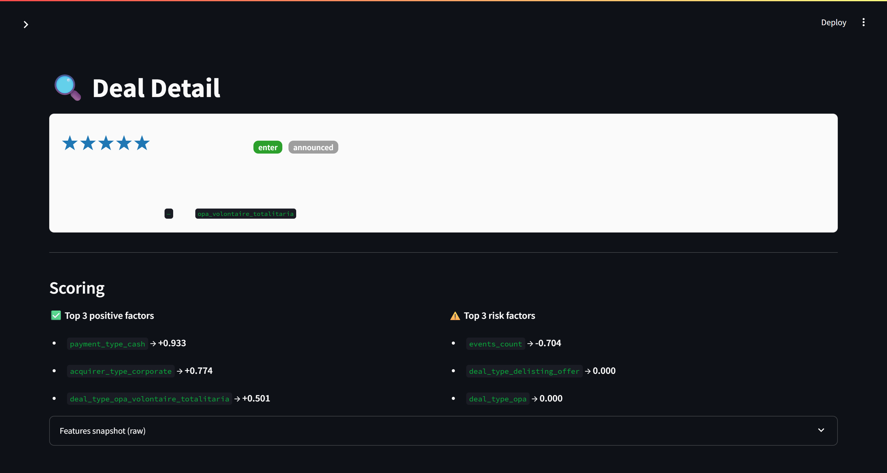
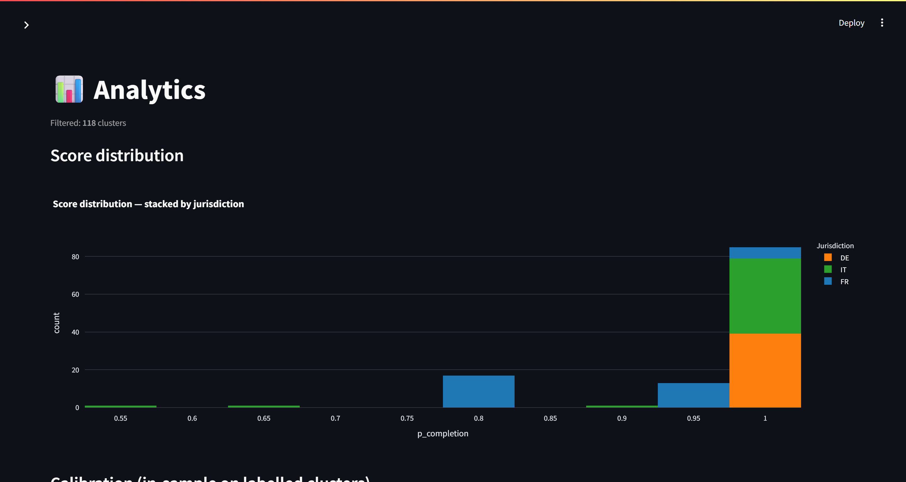
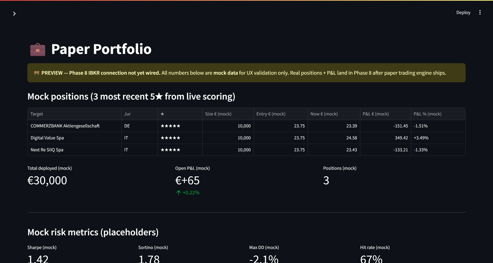

# Phase 7 — Live run screenshots & verification

Captured on **2026-05-21** against the live `ede` DB (329 scored clusters, model `scoring_v1_20260520T141111Z`, alembic head `0010`).
Stack: Python 3.12.10 venv, Streamlit 1.41.1, Plotly 5.24.1, psycopg 3.2.3. Viewport 1512×950, dark theme.

## Test suite

```
pytest tests/dashboard/ -v --cov=src/dashboard
58 passed in 96.48s
```

(41 pure-unit + 17 DB-integration. The integration tests need the venv `Scripts/` dir on `PATH` so the `_migrate_once` fixture finds the `alembic` CLI — otherwise they skip politely.)

Coverage on the dashboard package:

| Module | Cover |
|---|---|
| `src/dashboard/__init__.py` | 100% |
| `src/dashboard/charts.py` | 100% |
| `src/dashboard/scoring_helpers.py` | 100% |
| `src/dashboard/paper_portfolio_mock.py` | 99% |
| `src/dashboard/data.py` | 83% |

## Performance

Render to first KPI (in-page `performance.now()` timer, assets cold via `ignoreCache`, server `@st.cache_data` warm): **~1.05 s** — well under the 3 s brief target. No console errors/warnings across the whole session.

## Filters — all 6 verified (live `ede`, via `get_all_clusters`)

| Filter | Probe | Result |
|---|---|---|
| baseline (default 3/4/5★) | — | 118 |
| Jurisdiction | `[IT]` / `[DE]` | 43 / 39 |
| Score ★ | `[5]` vs `[3,4,5]` | 99 vs 118 |
| Status | `closed` / `pending` | 100 / 17 |
| Announcement date | 2026-01-01 → 2026-05-21 | 13 |
| Acquirer type | `[pe]` | 28 |
| Deal type | `[opr]` | 7 |

## Pages

### 1 — Overview

4 KPI cards (118/118 clusters, avg p 0.96), jurisdiction × ★ heat-map, Top-5 high-conviction (COMMERZBANK/UniCredit ★★★★★ p=1.00…), Top-5 watchlist (Banco BPM ★★★ p=0.56), recent-7-day activity.

### 2 — Deals List

Sortable `st.dataframe` of all 118 filtered clusters, native CSV download + "Export filtered CSV", drill-down selector. `spread (Φ)` column is the Phase-9 placeholder (`—`).

### 3 — Deal Detail (5★)

COMMERZBANK Aktiengesellschaft — ★★★★★, p_completion = 1.000, decision `enter`. Top-3 positive factors (payment_type_cash +0.933, acquirer_type_corporate +0.774, deal_type_opa_volontaire_totalitaria +0.501) / top-3 risk factors, identity table, events timeline (BaFin Angebotsunterlage), document link + local PDF path, manual-notes textarea.

### 4 — Analytics

Score distribution (stacked by jurisdiction), in-sample calibration plot (perfect vs observed), feature-importance bar (top-15 signed coefficients), pipeline timeline (scored clusters/month), class-balance pie (100 closed / 1 failed / 17 pending, imbalance 100:1).

### 5 — Paper Portfolio (preview)

🚧 **PREVIEW — Phase 8 IBKR connection not yet wired** banner present. Mock positions = 3 most-recent live 5★ (COMMERZBANK / Digital Value / Next Re SIIQ), €30k deployed, mock P&L +0.22%, mock risk metrics (Sharpe 1.42 / Sortino 1.78 / Max DD −2.1% / Hit 67%), watchlist of next 5★ candidates.

## Live-run findings

| # | Severity | Finding |
|---|---|---|
| 1 | **Bug** | Cross-page drill-down **buttons** raise `StreamlitAPIException: st.session_state.page cannot be modified after the widget with key "page" is instantiated` (`streamlit_app.py:369` Deals List "Open in Deal Detail"; same pattern at `:298-299` for Overview Top-5 `→`). The destination pages render fine via the sidebar radio; only the in-page navigation shortcut is broken. Not caught by tests (no Streamlit widget lifecycle in pytest). Fix: drive navigation through the radio's own `key="page"` (e.g. set the target into a separate state key consumed *before* the radio is instantiated, or `st.switch_page`), not by writing `session_state["page"]` after the widget exists. |
